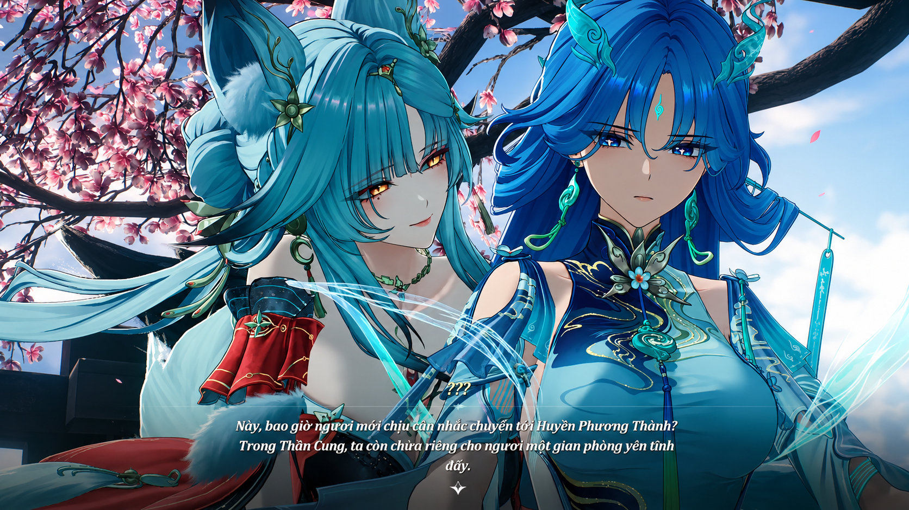
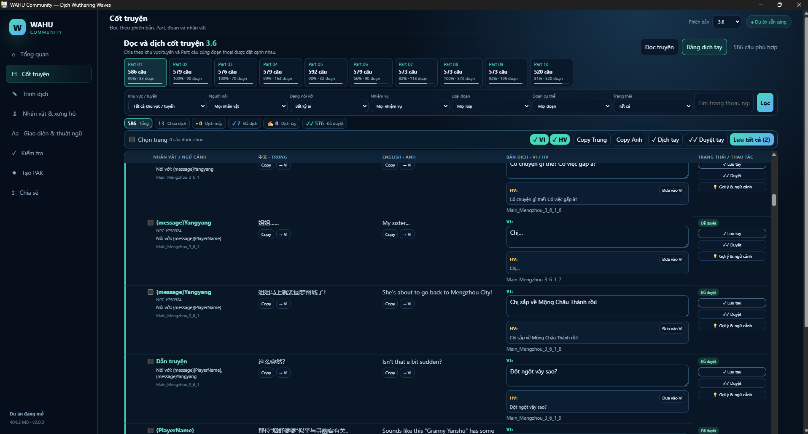

# 🎮 VHWuWa — Việt Hóa Wuthering Waves

VHWuWa là bộ cài và công cụ quản lý bản Việt hóa Wuthering Waves trên Windows.

Hiện hỗ trợ **Wuthering Waves 3.6**, hai lựa chọn tên nhân vật **Tên Anh / Hán Việt**, thay đổi font tiếng Việt và một số công cụ hỗ trợ cài đặt, gỡ bỏ và chỉnh sửa bản dịch.

[📥 Tải bản mới nhất](https://github.com/WahuVN/Viet-Hoa-WuWa/releases/latest) · [💬 Discord Windows](https://discord.gg/c9ws4q9U7) · [📱 Discord Android](https://discord.gg/3t5NSyJEz) · [🐛 Báo lỗi](https://github.com/WahuVN/Viet-Hoa-WuWa/issues)

---

## 📥 Tải xuống

### 🎮 `VHWuWa-v2.0.0-Windows.zip`
> Dành cho người chơi muốn cài bản Việt hóa.

Giải nén rồi chạy `00_BAT_DAU_CAI.bat` hoặc `app\VHWuWa.exe`.

### 👥 `WAHU-Community-v2.0.0.zip`
> Dành cho người muốn sửa, kiểm tra hoặc đóng góp bản dịch.

Tool hỗ trợ xem và chỉnh sửa nội dung CN / EN / VI / HV, tìm câu thoại, NPC, kỹ năng, UI và đóng gói dữ liệu để thử trong game.

> 📌 *Nếu chỉ muốn chơi bản Việt hóa, bạn không cần tải `Source code` do GitHub tự tạo.*

---

## 🎮 Cài đặt

1. Tải **`VHWuWa-v2.0.0-Windows.zip`**.
2. Giải nén ra thư mục riêng.
3. Chạy **`00_BAT_DAU_CAI.bat`**.
4. Bấm **Tự tìm game**.
5. Chọn **Tên Anh** hoặc **Hán Việt**.
6. Bấm **Cài Việt hóa**.
7. Trong game, đặt ngôn ngữ hiển thị là **English** (và chạy bằng **DirectX 11**).

*Nếu tự tìm game không hoạt động, hãy chọn thư mục game có chứa thư mục con `Client` (ví dụ: `D:\Game\Wuthering Waves Game`).*

---

## 📖 Bản Việt hóa

Bản hiện tại hỗ trợ nội dung Wuthering Waves 3.6, bao gồm:

- Cốt truyện chính 3.6 (1.827/1.827 câu).
- Thoại NPC ngoài thế giới.
- Kỹ năng, UI, vật phẩm và thuật ngữ.
- Hai biến thể Tên Anh (*Jinhsi, Changli, Yangyang...*) / Hán Việt (*Kim Tịch, Trường Ly, Ương Ương...*).
- Có 70+ font hỗ trợ tiếng Việt.

Chi tiết thay đổi của từng phiên bản xem tại [Releases](https://github.com/WahuVN/Viet-Hoa-WuWa/releases) hoặc [CHANGELOG.md](CHANGELOG.md).

## 📸 Hình ảnh / Screenshots

### 🎮 Trải nghiệm Việt hóa trong game


### 👥 Công cụ dịch WAHU Community


---

## 🔤 Font

Có thể đổi font trực tiếp trong VHWuWa, xem trước trước khi cài hoặc sử dụng font ngoài `.ttf`, `.otf`, `.ttc`.

---

## 👥 WAHU Community

Tool dành cho người muốn tham gia chỉnh sửa bản dịch:

- Đối chiếu song song CN / EN / VI / HV.
- Xem người nói và ngữ cảnh hội thoại.
- Sửa cốt truyện, NPC, UI, kỹ năng và thuật ngữ.
- Kiểm tra dữ liệu và tạo bản thử nghiệm.

Hướng dẫn chi tiết: [HUONG_DAN_TAI_DUNG_GOI.md](HUONG_DAN_TAI_DUNG_GOI.md).

---

## ⚠️ Lưu ý

- **VHWuWa là dự án cộng đồng**, không phải sản phẩm chính thức của Kuro Games và không được Kuro Games bảo trợ hoặc ủy quyền.
- Bản Việt hóa có thay đổi một số tệp của game. Dự án **không thể bảo đảm hoàn toàn về rủi ro tài khoản hoặc anti-cheat** khi sử dụng.
- Hãy tự cân nhắc trước khi cài.

---

## 💬 Hỗ trợ & đóng góp

Gặp lỗi dịch, lỗi font hoặc lỗi cài đặt:

- 🎮 **Discord VHWuWa — Windows:** [https://discord.gg/c9ws4q9U7](https://discord.gg/c9ws4q9U7)
- 🐛 **Báo lỗi:** [GitHub Issues](https://github.com/WahuVN/Viet-Hoa-WuWa/issues)

> 📱 **Việt hóa Android:** Đây là dự án riêng do Dangdev phụ trách.  
> 👉 **Discord:** [https://discord.gg/3t5NSyJEz](https://discord.gg/3t5NSyJEz)

Đóng góp mã nguồn và bản dịch đều được chào đón.

---

## 🔧 Build từ mã nguồn

Yêu cầu: Windows 10/11 x64 và .NET 8 SDK.

```bash
dotnet restore VHWuWa.sln
dotnet test VHWuWa.sln -c Release
dotnet build VHWuWa.sln -c Release
```

---

## ⚖️ Giấy phép

Mã nguồn được phân phối theo giấy phép [MIT License](LICENSE).


