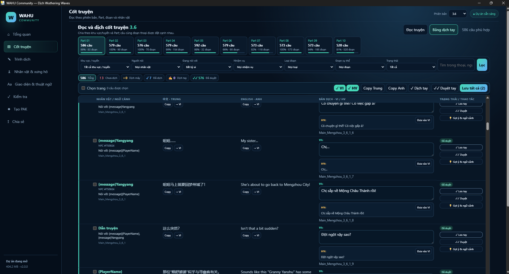
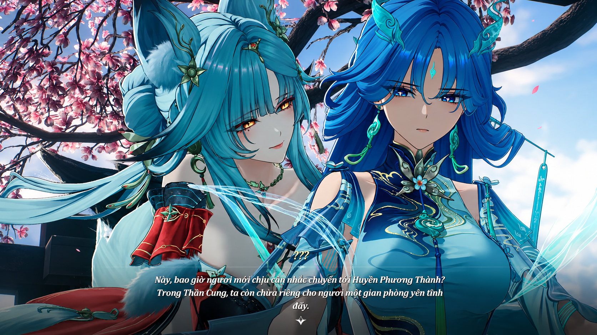

<div align="center">


# VHWuWa — Bộ Cài & Quản Lý Việt Hóa Wuthering Waves

Bộ công cụ Việt hóa dành cho **Wuthering Waves trên PC/Windows**, hỗ trợ cài đặt, cập nhật, tùy biến phông chữ và quản lý bản dịch tiếng Việt.

[](https://github.com/WahuVN/Viet-Hoa-WuWa/releases/latest)
[](https://github.com/WahuVN/Viet-Hoa-WuWa/releases/latest)
[](https://github.com/WahuVN/Viet-Hoa-WuWa/releases/latest)
[](LICENSE)
[](https://discord.gg/Gy5YQ84Yc2)

[Tải Xuống](#-tải-xuống) • [Hướng Dẫn Cài Đặt](#-hướng-dẫn-cài-đặt) • [Tính Năng Chính](#-tính-năng-chính) • [Dành Cho Nhà Phát Triển](#-dành-cho-nhà-phát-triển) • [Lưu Ý](#-lưu-ý--tuyên-bố-miễn-trừ)

</div>

---

## 📸 Hình ảnh thực tế

| Giao diện cài đặt VHWuWa | Trải nghiệm trong game |
| :---: | :---: |
|  |  |

---

## 🎯 Giới thiệu & Tính năng chính

VHWuWa được thiết kế nhằm hỗ trợ người chơi trải nghiệm trọn vẹn cốt truyện và hệ thống Wuthering Waves bằng tiếng Việt với thao tác trực quan, an toàn:

- **Tự động nhận diện & Cài đặt 1-Click:** Tự động tìm thư mục game ngay khi mở app và thiết lập trọn gói bản dịch, font chữ chỉ với 1 click.
- **Tự động cập nhật:** Tự phát hiện bản mới và cập nhật trực tiếp từ ứng dụng, không cần tải lại thủ công.
- **Ẩn hoặc đổi biệt hiệu UID:** Tùy biến hoặc ẩn hoàn toàn UID ở góc màn hình, thẻ Profile Esc, khung Chat/Co-op và chế độ Chụp ảnh giúp bảo vệ riêng tư khi stream, quay clip.
- **Làm mới 100% Danh Hiệu Nhân Vật:** Tinh chỉnh danh hiệu ngắn gọn, chuẩn tiếng Việt (2 - 4 từ), không bị tràn viền giao diện.
- **Tùy chọn phong cách hiển thị tên nhân vật:**
  - **Bản Tiếng Việt (Tên EN):** Giữ nguyên tên nhân vật theo chuẩn quốc tế (`Jinhsi`, `Changli`, `Jiyan`, `Yangyang`...).
  - **Bản Hán Việt:** Hiển thị tên nhân vật theo âm Hán Việt cổ phong (`Kim Tịch`, `Trường Ly`, `Kỵ Viêm`, `Ương Ương`...).
- **Bộ sưu tập phông chữ đa dạng:** Hơn 70 phông chữ tiếng Việt tuyển chọn đã tinh chỉnh tương thích game, có khung xem trước chữ mẫu trực quan.
- **Cập nhật nhanh chóng:** Tự động kiểm tra và cập nhật dữ liệu bản dịch mới từ GitHub Releases.
- **Quản lý gói ngôn ngữ an toàn:** Cài đặt và gỡ bỏ bản Việt hóa dễ dàng, độc lập với dữ liệu gốc của trò chơi.

---

## 📥 Tải xuống

| Gói tải về | Đối tượng | Mô tả |
| :--- | :--- | :--- |
| 🎮 [**VietHoa-WuWa-v3.0.15.zip**](https://github.com/WahuVN/Viet-Hoa-WuWa/releases/latest) | **Người chơi** | Ứng dụng cài đặt Việt hóa trên Windows (Khuyên dùng) |
| 🛠️ [**App-Dich-WuWa-v3.0.15.zip**](https://github.com/WahuVN/Viet-Hoa-WuWa/releases/latest) | **Dịch giả / Người đóng góp** | Bộ công cụ WAHU Community hỗ trợ xem ngữ cảnh, kiểm tra chất lượng bản dịch và đóng gói dữ liệu |
| 📱 [**VHWuWa Mobile 0.2.0-alpha.13**](https://github.com/WahuVN/VHWuWa-Mobile/releases) | **Android** | Android 10+, cài Việt hóa qua Shizuku; hỗ trợ game 3.7.0, nội dung Việt hóa 3.7.0-R4 |

> [!IMPORTANT]
> Người chơi chỉ cần tải gói **`VietHoa-WuWa-v3.0.15.zip`**. Ứng dụng sẽ tự động tải các gói tài nguyên cần thiết khi cài đặt.

---

## ⚡ Hướng dẫn cài đặt

### Yêu cầu hệ thống
- **Hệ điều hành:** Windows 10 hoặc Windows 11 (64-bit).
- **Game:** Wuthering Waves phiên bản PC (Launcher chính thức hoặc Epic Games Store).

### Các bước thực hiện
1. Tải file **`VietHoa-WuWa-v3.0.15.zip`** mới nhất và giải nén ra một thư mục riêng.
2. Mở file **`VHWuWa.exe`** (hoặc `Chay VHWuWa.bat`).
3. Chọn **"Tự tìm game"** (nếu chưa tìm thấy, hãy chọn thủ công thư mục game có chứa thư mục `Client`).
4. Chọn kiểu tên nhân vật mong muốn (**Tiếng Anh** hoặc **Hán Việt**) và chọn phông chữ yêu thích.
5. Bấm **"Cài Việt Hóa"** và đợi thông báo hoàn tất.
6. Mở game, vào phần **Cài đặt (Settings) → Ngôn ngữ (Language)** và chọn **Text Language = English**.

> [!TIP]
> Khuyến nghị khởi chạy game ở chế độ **DirectX 11** để đạt độ ổn định và khả năng tương thích đồ họa tốt nhất.

---

## 🛠️ Dành cho nhà phát triển

### Cấu trúc thư mục

```text
WuwaVH/
├── VHWuWa/                  # Repo app/bộ cài người chơi (.NET 8)
├── wuwavh_tool/
│   └── Wahu/                # Pipeline dịch, QA, build PAK, WAHU Community
│       ├── project.db       # Database project hiện hành
│       ├── data/            # Authority và dữ liệu build
│       ├── _dbcfg/          # ConfigDB nguồn
│       └── dist/            # R7 final và artifact local
├── _QUY_UOC_DICH_NOI_BO/    # Chỉ giữ authority V6.2.1 hiện hành
├── Text Gốc/                # Nguồn text cần tra cứu
├── camera_mod/              # Project camera mod độc lập
└── docs/                    # Hướng dẫn, layout và báo cáo lưu trữ
```

Xem sơ đồ chi tiết và quy tắc đặt file tại [`docs/PROJECT_LAYOUT.md`](docs/PROJECT_LAYOUT.md).

### Hướng dẫn biên dịch từ mã nguồn

**Yêu cầu môi trường:**
- [.NET 8.0 SDK](https://dotnet.microsoft.com/download/dotnet/8.0)
- Visual Studio 2022 hoặc VS Code với C# Dev Kit.
- Python 3.10+ (dành cho bộ công cụ Wahu đóng gói dữ liệu).

```powershell
# 1. Khôi phục các thư viện cần thiết cho ứng dụng
dotnet restore VHWuWa/VHWuWa.sln

# 2. Biên dịch bản phát hành
dotnet build VHWuWa/VHWuWa.sln -c Release

# 3. Chạy kiểm thử tự động
dotnet test VHWuWa/VHWuWa.sln -c Release

# 4. Đóng gói bộ cài phát hành (tùy chọn)
powershell -ExecutionPolicy Bypass -File VHWuWa/scripts/build-dist.ps1 -Version 3.0.15
```

---

## ⚠️ Lưu ý & Tuyên bố miễn trừ

- **Dự án cộng đồng phi thương mại:** VHWuWa là dự án do cộng đồng người chơi phát triển nhằm hỗ trợ người dùng Việt Nam, không trực thuộc, không được tài trợ hay ủy quyền bởi Kuro Games.
- **An toàn tệp tin:** Công cụ chỉ thay đổi các tệp phục vụ hiển thị ngôn ngữ, không can thiệp vào bộ nhớ đang chạy hay cơ chế chiến đấu của game. Tuy nhiên, đây vẫn là công cụ bên thứ ba nên người dùng cần tự cân nhắc trước khi sử dụng.
- **Thao tác an toàn:** Luôn tắt hoàn toàn game và launcher trước khi cài đặt hoặc gỡ bỏ bản dịch.

---

## 💬 Kênh hỗ trợ & Liên hệ

- **Thảo luận & Hỗ trợ kỹ thuật:** [Server Discord Wuthering Waves VN](https://discord.gg/Gy5YQ84Yc2)
- **Báo lỗi & Đóng góp ý kiến:** [Gửi phản hồi tại GitHub Issues](https://github.com/WahuVN/Viet-Hoa-WuWa/issues)
- **Bản Việt hóa Android:** [VHWuWa Mobile — WahuVN](https://github.com/WahuVN/VHWuWa-Mobile/releases) · Android 10+ · Shizuku · game 3.7.0 / content 3.7.0-R4

---

## 📄 Giấy phép

Toàn bộ mã nguồn của dự án được phát hành theo giấy phép [MIT License](LICENSE).
